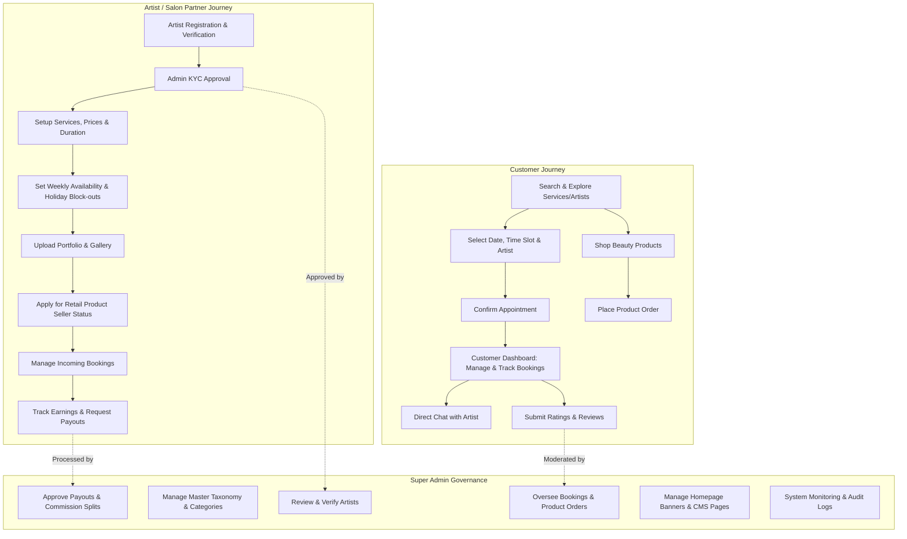
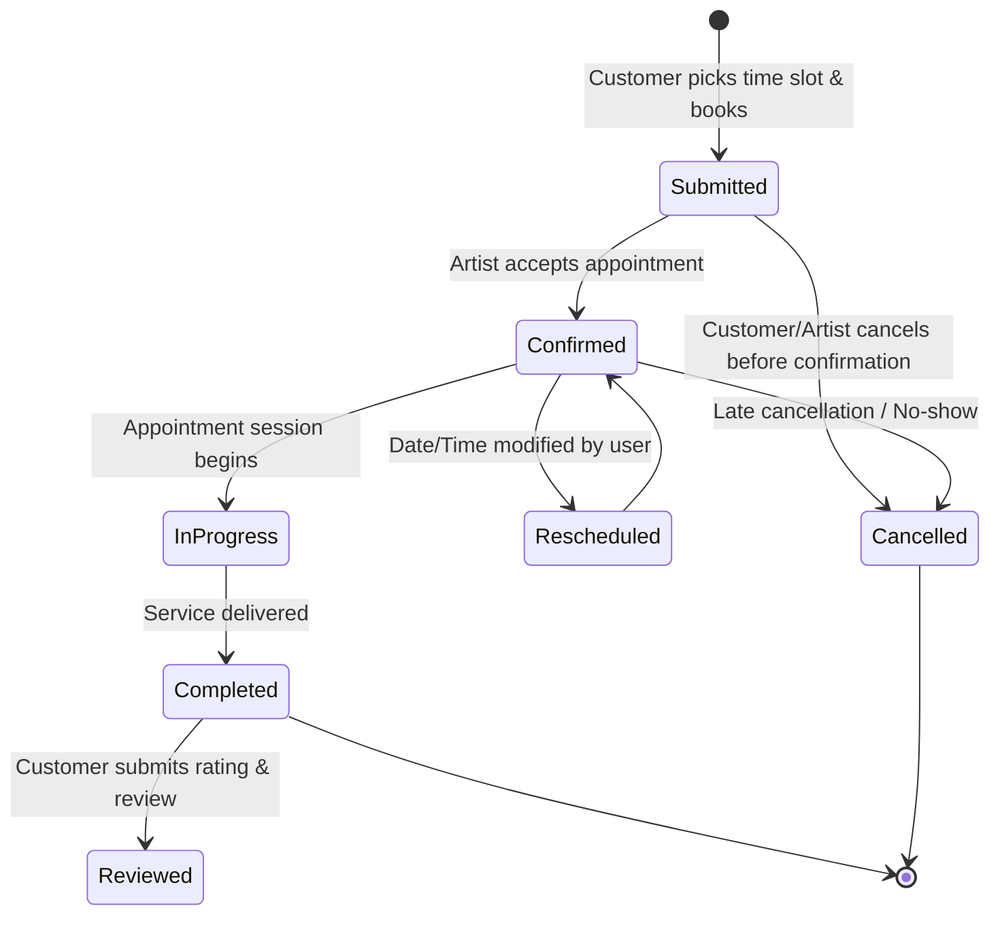
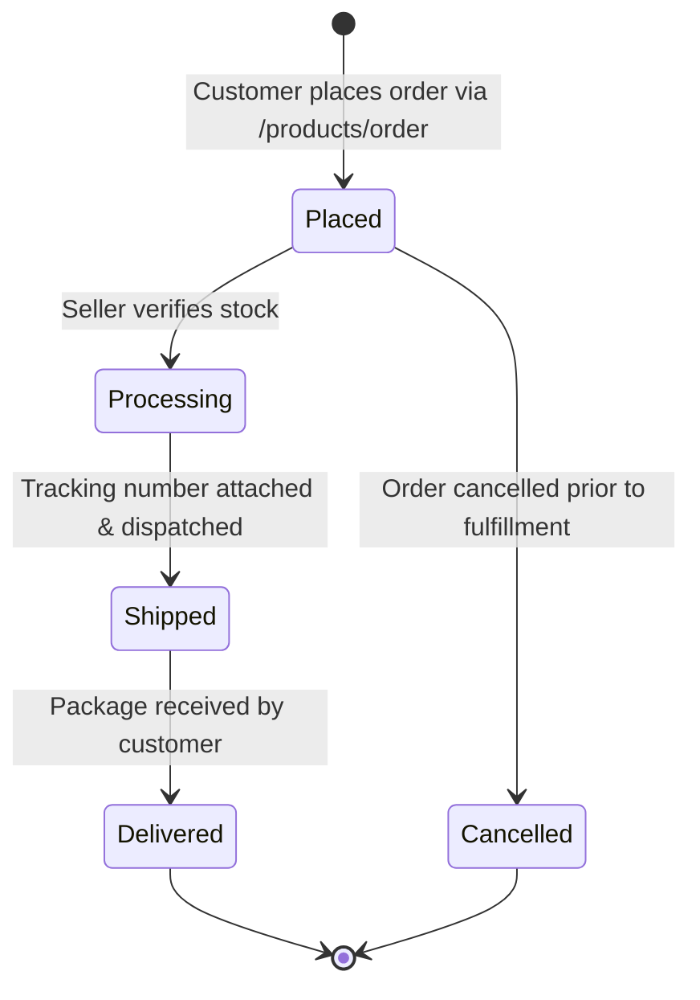
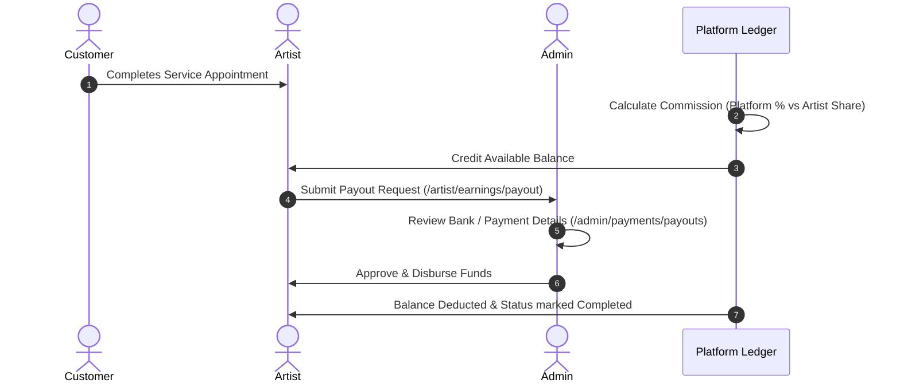

# Beauty Salon Marketplace - Complete Site Flow & Architecture Specification

---

## Executive Overview
The **Beauty Salon Marketplace** is a multi-vendor beauty ecosystem that connects **Clients/Customers** with independent **Beauty Artists & Salons**, supervised and managed by a centralized **Super Admin** administration portal.

The platform provides:
- **Service Bookings**: Time-slot scheduling, dynamic calendar availability, notifications, and customer reviews.
- **E-Commerce Retail Store**: Beauty product catalog, multi-vendor seller applications, order processing, and tracking.
- **Artist CRM & Business Suite**: Service customization, portfolio showcase, holiday planning, direct client messaging, discount offers, and earnings payout ledger.
- **Admin Control Tower**: Verification/approvals, financial management (commissions and payouts), CMS page/banner control, and audit logs.

---

## 1. System Architecture & Role-Based Routing

```mermaid
flowchart TD
    Guest[🌐 Guest / Visitor] -->|Browse Marketplace| Catalog[Catalog: Home, Services, Artists, Products]
    Guest -->|Authentication| AuthGate{Auth Gateway}
    
    AuthGate -->|Register as Client| RegCust[Customer Account]
    AuthGate -->|Register as Partner| RegArtist[Artist Application]
    AuthGate -->|Login| CentralRedirect[/dashboard]

    CentralRedirect -->|Role: Customer| CustPortal[Customer Portal: /customer/*]
    CentralRedirect -->|Role: Artist| ArtistStatusCheck{Approval Status}
    CentralRedirect -->|Role: Admin| AdminPortal[Admin Panel: /admin/*]

    ArtistStatusCheck -->|pending / rejected| PendingScreen[/artist/pending-approval]
    ArtistStatusCheck -->|approved| ArtistPortal[Artist Dashboard: /artist/*]
```

---

## 2. Comprehensive Role Flows



---

## 3. End-to-End Core Lifecycles

### 3.1 Service Booking Lifecycle



**Step-by-Step Flow:**
1. **Selection**: Customer browses `/services` or `/artists/{slug}`, selects desired service(s), and selects an available slot computed from the artist's schedule minus booked slots.
2. **Creation**: Route `POST /bookings` creates the booking with status `pending`.
3. **Artist Action**: Artist receives notification $\rightarrow$ navigates to `/artist/bookings` $\rightarrow$ Accepts (`confirmed`) or Rejects (`cancelled`).
4. **Execution**: On appointment day, the status transitions to `in_progress` then `completed`.
5. **Review**: Completed bookings unlock the review form (`/customer/reviews/create/{booking}`) allowing 1-5 star ratings and written feedback.

---

### 3.2 E-Commerce & Product Retail Lifecycle



**Step-by-Step Flow:**
1. **Seller Authorization**: Artist applies via `/artist/products/apply` $\rightarrow$ Admin verifies seller credentials at `/admin/products/sellers`.
2. **Catalog Management**: Approved sellers create and manage product inventory at `/artist/products`.
3. **Purchase**: Customer submits order $\rightarrow$ Order registered under `/customer/orders`.
4. **Fulfillment**: Artist tracks items at `/artist/products/orders` and updates fulfillment statuses (`processing` $\rightarrow$ `shipped` $\rightarrow$ `delivered`).

---

### 3.3 Financial & Payout Lifecycle



---

## 4. Complete Route Directory & Capabilities

### 🌐 Public & Guest Endpoints
| URI Pattern | Name | Description |
| :--- | :--- | :--- |
| `GET /` | `home` | Landing page with hero banners, featured categories & artists |
| `GET /artists` | `artists.index` | Searchable/filterable artist directory |
| `GET /artists/{slug}` | `artists.show` | Public artist profile, gallery, reviews & service menu |
| `GET /services` | `services.index` | Public catalog of salon treatments and services |
| `GET /products` | `products.index` | Public e-commerce beauty store |
| `POST /products/order` | `products.order.store`| Checkout endpoint for product purchases (Auth required) |
| `GET /bookings/create` | `bookings.create` | Booking wizard step with interactive schedule picker |

---

### 👤 Customer Portal (`/customer/*`)
| URI Pattern | Name | Action / Purpose |
| :--- | :--- | :--- |
| `GET /customer/dashboard` | `customer.dashboard` | Overview of upcoming appointments, recent orders & stats |
| `GET /customer/bookings` | `customer.bookings.index`| History of all active and past bookings |
| `GET /customer/bookings/{id}` | `customer.bookings.show` | Booking detail, invoice preview, and artist details |
| `POST /customer/bookings/{id}/cancel` | `customer.bookings.cancel` | Cancel an active appointment |
| `POST /customer/bookings/{id}/reschedule` | `customer.bookings.reschedule` | Change appointment time slot |
| `GET /customer/orders` | `customer.orders.index` | E-commerce product orders list & delivery tracker |
| `GET /customer/favorites` | `customer.favorites.index`| Saved favorite artists and wishlist services |
| `GET /customer/messages` | `customer.messages.index` | Client-to-Artist direct messaging inbox |
| `GET /customer/reviews` | `customer.reviews.index` | My submitted reviews & pending review reminders |

---

### 💄 Artist / Salon Portal (`/artist/*`)
*Protected by `auth` and `artist.approved` middleware.*

| URI Pattern | Name | Action / Purpose |
| :--- | :--- | :--- |
| `GET /artist/pending-approval`| `artist.pending-approval` | Verification hold screen for new artist accounts |
| `GET /artist/dashboard` | `artist.dashboard` | KPI overview: Today's schedule, monthly revenue, ratings |
| `GET /artist/profile/edit` | `artist.profile.edit` | Update bio, location, salon address, profile & cover photos |
| `GET /artist/services` | `artist.services.index` | Manage salon services, durations, pricing & gallery images |
| `GET /artist/availability` | `artist.availability.index`| Set working hours, day-of-week slots, and holiday blocks |
| `GET /artist/calendar` | `artist.calendar` | Interactive full-calendar schedule view |
| `GET /artist/portfolio` | `artist.portfolio.index` | Upload before/after showcases and tagged portfolio items |
| `GET /artist/products` | `artist.products.index` | Seller dashboard, product listing & inventory manager |
| `GET /artist/bookings` | `artist.bookings.index` | Accept, manage, reschedule, and complete appointments |
| `GET /artist/offers` | `artist.offers.index` | Create promotional vouchers, promo codes & discounts |
| `GET /artist/earnings` | `artist.earnings.index` | Financial statements, breakdown of commission & payout requests |
| `GET /artist/messages` | `artist.messages.index` | Real-time chat with clients & auto-reply rule configuration |

---

### 🛡️ Admin Control Tower (`/admin/*`)
*Protected by `auth` and `admin` role middleware.*

| URI Pattern | Name | Action / Purpose |
| :--- | :--- | :--- |
| `GET /admin/dashboard` | `admin.dashboard` | Platform metrics: GMV, Total Bookings, Active Artists, System health |
| `GET /admin/artists` | `admin.artists.index` | Artist directory: Verify KYC, Approve, Suspend, Feature, Verify badge |
| `GET /admin/customers` | `admin.customers.index` | Customer directory & status management |
| `GET /admin/bookings` | `admin.bookings.index` | Master bookings control with status overrides |
| `GET /admin/categories` | `admin.categories.index` | Manage marketplace categories, taxonomy, and service groupings |
| `GET /admin/products` | `admin.products.index` | Product moderation, seller authorizations & master order tracker |
| `GET /admin/reviews` | `admin.reviews.index` | Review moderation: approve, reject, or remove flagged feedback |
| `GET /admin/payments` | `admin.payments.index` | Financial ledger: Approve/Reject artist payouts, commission splits |
| `GET /admin/notifications` | `admin.notifications.index`| Create platform-wide broadcast announcements |
| `GET /admin/content/banners` | `admin.content.banners` | Manage homepage promotional banners and sliders |
| `GET /admin/content/pages` | `admin.content.pages` | CMS static pages (Terms of Service, Privacy, FAQs, About) |
| `GET /admin/settings` | `admin.settings.index` | Global marketplace configuration & database backups |
| `GET /admin/logs` | `admin.logs.index` | System audit logs, activity monitoring & export tools |

---

## 5. Summary Matrix: User Permissions & Modules

| Platform Capability | Guest | Customer | Artist | Super Admin |
| :--- | :---: | :---: | :---: | :---: |
| Browse Artists, Services & Products | ✅ | ✅ | ✅ | ✅ |
| Book Appointments & Checkout | ❌ | ✅ | ❌ | ✅ (View) |
| Purchase Retail Products | ❌ | ✅ | ✅ | ✅ (View) |
| Manage Schedule & Working Hours | ❌ | ❌ | ✅ | ✅ (View) |
| Offer Retail Products for Sale | ❌ | ❌ | ✅ (Upon Auth) | ✅ (Manage) |
| Request Earnings Payout | ❌ | ❌ | ✅ | ❌ |
| Approve / Reject KYC Applications | ❌ | ❌ | ❌ | ✅ |
| Configure Platform Commission & Payouts | ❌ | ❌ | ❌ | ✅ |
| Manage CMS, Banners & System Logs | ❌ | ❌ | ❌ | ✅ |
